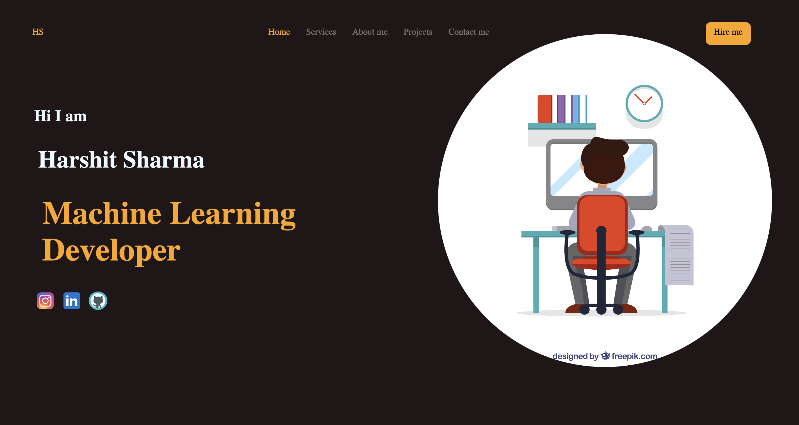

# 💼 Portfolio Website

Welcome to my **personal portfolio website** repository! This website showcases my skills, projects, resume, and social links — built to highlight my work as a developer and tech enthusiast.

## 🔗 Live Preview

🌐 [Visit Portfolio Website](https://harshit-077.github.io/PortfolioWebsite/)


---

## 🛠️ Built With

- **HTML5**
- **CSS3**
- **JavaScript**
- *(Optional additions based on your stack like React, Tailwind, Bootstrap, etc.)*

---

## 📂 Features

- ✨ Clean, responsive design
- 🧑 About Me section
- 🛠️ Skills & Technologies
- 📁 Projects with live links
- 📄 Downloadable Resume
- 🌐 Social Media Links

---

## 📸 Screenshots

*(Add screenshots of homepage, projects section, contact form, etc. if possible)*



---

## 🚀 Getting Started

### Prerequisites

To run this project locally:

- A modern browser (Chrome, Firefox, Safari)
- [Live Server](https://marketplace.visualstudio.com/items?itemName=ritwickdey.LiveServer) extension in VS Code (optional)

### Run Locally

```bash
git clone https://github.com/Harshit-077/PortfolioWebsite.git
cd PortfolioWebsite
